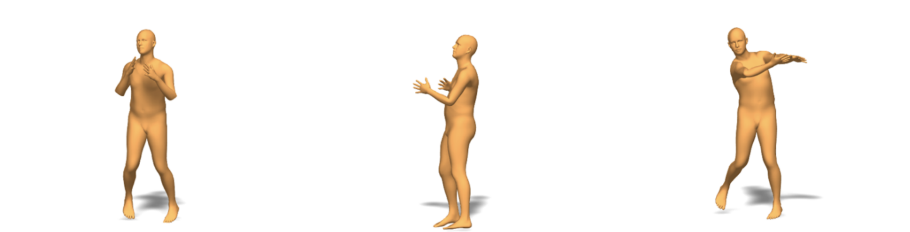
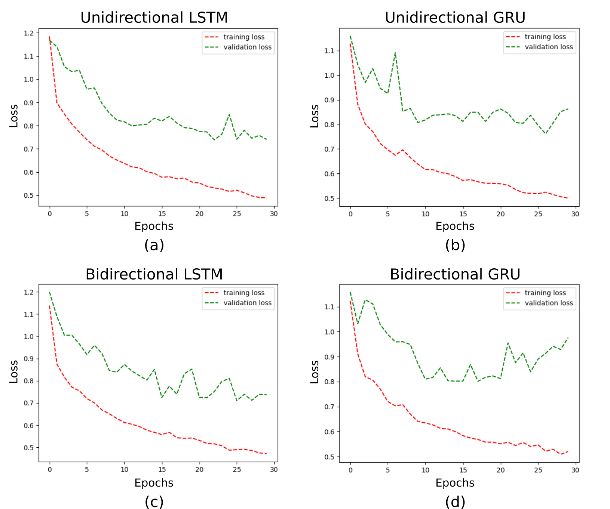

# A Comparative Analysis of IMU-based Motion Prediction Methods
<figure>
  
</figure>

Quantitative measurements of a person’s pose during activities of daily living could provide useful information
for many applications. In recent years, wearable sensors have become common, with possible applications in
bio-mechanical monitoring, sports, and fitness training, rehabilitation, assistive devices, mining, human-robot
teaming, and virtual reality. In this paper, we represent an approach to estimate dense 3D human pose only from 6
IMU sensor orientation data using Deep Learning. We aim to perform a comparative analysis of the method based
on different network architectures. Specifically, we implement this algorithm using four deep learning models, (1)
Long-Short Term Memory (LSTM), (2) Bi-directional LSTM (BiLSTM), (3) Gated Recurrent Unit (GRU), (4)
Bidirectional GRU (BiGRU) and compare their performances. Our work is motivated by Deep Inertial Poser
(DIP) and we have used datasets published by them

The DIP-IMU dataset can be downloaded from the following link:

[Link to DIP_IMU dataset](https://drive.google.com/file/d/11jatRze_KlKH61ir1eu-xfeFD65nbvPj/view?usp=sharing)

Unzip the dataset in the folder `./AML_project`

The Bidirectional LSTM model can be trained as follows:

```bash
python3 DIP_IMU_NN_BiRNN.py --run-name lstm_bi --network LSTM --bidirectional --train --epochs 30
```
For training the other models, you can use the arguments we provided in `./hyperparameters.yaml`.

You can change the number of epochs for which the model is trained to observe the change in performance. 

If you just wish to plot the data obtained from previously trained models, use the following command:

```bash
python3 DIP_IMU_NN_BiRNN.py --run-name <name_of_run_you_wish_to_plot> 
```
# Ablation Study Results

<figure>
  
</figure>
